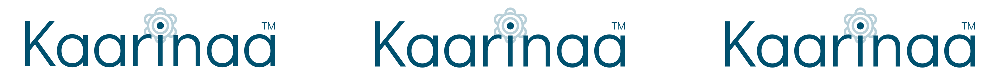

  

# Spelling Bee Word List

This repository contains a curated list of words which appear in the Roblox game [*Spelling Bee*](https://www.roblox.com/games/17590362521). The list is intended to assist players, developers, and educators who want to analyze or interact with the word data for learning, reference, or game strategy purposes.

---

## About

* The word list includes words which appear in the Roblox game [*Spelling Bee*](https://www.roblox.com/games/17590362521).
* This repository is **not affiliated** with Roblox Corporation.
* The word list is compiled for educational, analytical, and personal use.
* The word list is compiled by [AlinaWan](https://github.com/AlinaWan) and contributors.
* Some words were borrowed from the [*Spelling Bee page*](https://roblox.fandom.com/wiki/Bean%27s_Can/Spelling_Bee!) on the [Roblox Wiki](https://roblox.fandom.com/wiki/Roblox_Wiki), with credit to its original contributors.
* This repository is proudly backed by Kaarinaa™.
> [!WARNING]
> Sharing or distributing the word list is technically a breach of Spelling Bee’s Terms of Service and may result in penalties such as game bans.
> We are **not responsible** for any consequences resulting from your use of the word list. Use at your own risk.

---

## Usage

Feel free to:

* Browse and explore the word list.
* Use it as a reference or learning tool.
* Incorporate it into your own projects.

---

## No Fraudulent or Baseless Cease and Desist Notices

We respect intellectual property rights and legal processes. However, we will **not** tolerate fraudulent, misleading, or abusive cease and desist claims intended to intimidate or censor this repository without a valid legal basis. Any such claims may be met with appropriate legal response.

---

## Disclaimer

* This repository is provided "as-is" without any warranties.
* We are not responsible for any misuse of the word list.
* Use at your own discretion.

---

## Contributions

Contributions, suggestions, and corrections to improve the word list are welcome via pull requests or issues.

---

## License

This repository is licensed under the [**Creative Commons Zero v1.0 Universal (CC0 1.0)**](LICENSE) Public Domain Dedication.

Kaarinaa™ is a trademark of Kaarinaa and is protected by applicable intellectual property laws, including common law rights. All rights reserved.
